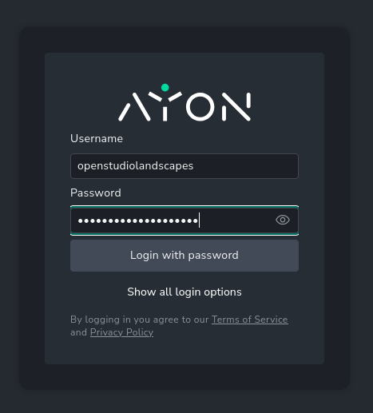
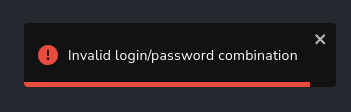
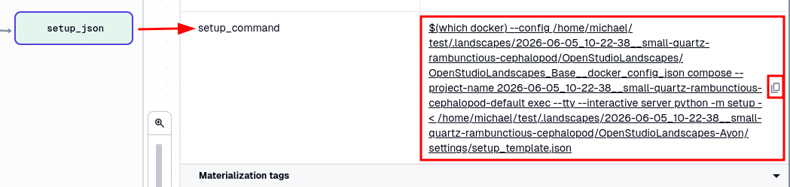
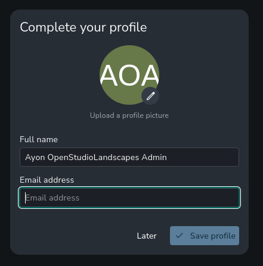

[](https://github.com/michimussato/OpenStudioLandscapes)

***

1. [Feature: OpenStudioLandscapes-Ayon](#feature-openstudiolandscapes-ayon)
   1. [Brief](#brief)
   2. [Clone](#clone)
      1. [Clone and Install](#clone-and-install)
   3. [Configure](#configure)
      1. [Default Configuration](#default-configuration)
   4. [Local Development/Unit Testing/Debugging](#local-developmentunit-testingdebugging)
   5. [Initial OpenStudioLandscapes-Ayon Server Setup](#initial-openstudiolandscapes-ayon-server-setup)
2. [External Resources](#external-resources)
   1. [Official Documentation](#official-documentation)
      1. [Dev Resources](#dev-resources)
3. [Community](#community)

***

This `README.md` was dynamically created with [OpenStudioLandscapesUtil-ReadmeGenerator](https://github.com/michimussato/OpenStudioLandscapesUtil-ReadmeGenerator).

***

# Feature: OpenStudioLandscapes-Ayon

## Brief

This is an extension to the OpenStudioLandscapes ecosystem. The full documentation of OpenStudioLandscapes is available [here](https://github.com/michimussato/OpenStudioLandscapes).

> [!NOTE]
> 
> You feel like writing your own Feature? Go and check out the 
> [OpenStudioLandscapes-Template](https://github.com/michimussato/OpenStudioLandscapes-Template).

## Clone

Clone this repository into `OpenStudioLandscapes/.features` (assuming the current working directory to be the Git repository root `./OpenStudioLandscapes`):

```shell
# cd OpenStudioLandscapes
source .venv/bin/activate
openstudiolandscapes clone-feature --repo=https://github.com/michimussato/OpenStudioLandscapes-Ayon.git
deactivate
# Check the resulting console output for installation instructions
```

### Clone and Install

```shell
# cd OpenStudioLandscapes
source .venv/bin/activate
openstudiolandscapes clone-feature --repo=https://github.com/michimussato/OpenStudioLandscapes-Ayon.git \
    && pip install --editable ./.features/OpenStudioLandscapes-Ayon
deactivate
```

For more info on `pip` see [VCS Support of `pip`](https://pip.pypa.io/en/stable/topics/vcs-support/).

## Configure

OpenStudioLandscapes will search for a local config store. The default location is `~/.config/OpenStudioLandscapes/config-store/` but you can specify a different location if you need to.

> [!TIP]
> 
> To specify a config store location different from
> the default location, check out the OpenStudioLandscapes 
> [CLI Section](https://github.com/michimussato/OpenStudioLandscapes#cli)
> to find out how to do that.

A local config store location will be created if it doesn't exist, together with the `config.yml` files for each individual Feature.

> [!TIP]
> 
> The config store root will be initialized as a local Git
> controlled repository. This makes it easy to track changes
> you made to the `config.yml`.

The following settings are available in `OpenStudioLandscapes-Ayon` and are based on [`OpenStudioLandscapes-Ayon/tree/main/src/OpenStudioLandscapes/Ayon/config/models.py`](https://github.com/michimussato/OpenStudioLandscapes-Ayon/tree/main/src/OpenStudioLandscapes/Ayon/config/models.py).

### Default Configuration

<details open>
<summary><code>config.yml</code></summary>


```yaml
ayon_addons_dir:
  default: '{DOT_LANDSCAPES}/{LANDSCAPE}/{FEATURE}/data/server/addons'
  description: The host side Ayon addons directory.
  format: path
  title: Ayon Addons Dir
  type: string
ayon_db_install_destination:
  default: '{DOT_LANDSCAPES}/{LANDSCAPE}/{FEATURE}/data/postgres/data/ayon-db'
  description: The host side Ayon database installation destination.
  format: path
  title: Ayon Db Install Destination
  type: string
ayon_port_container:
  default: 5000
  description: The Ayon container port.
  exclusiveMinimum: 0
  title: Ayon Port Container
  type: integer
ayon_port_host:
  default: 5005
  description: The Ayon host port.
  exclusiveMinimum: 0
  title: Ayon Port Host
  type: integer
ayon_storage_dir:
  default: '{DOT_LANDSCAPES}/{LANDSCAPE}/{FEATURE}/data/server/storage'
  description: The host side Ayon storage directory.
  format: path
  title: Ayon Storage Dir
  type: string
compose_scope:
  default: default
  examples:
  - default
  - license_server
  - worker
  title: Compose Scope
  type: string
docker_compose:
  default: '{DOT_LANDSCAPES}/{LANDSCAPE}/{FEATURE}/docker_compose/docker-compose.yml'
  description: The path to the `docker-compose.yml` file.
  format: path
  title: Docker Compose
  type: string
docker_compose_override:
  default: '{DOT_LANDSCAPES}/{LANDSCAPE}/{FEATURE}/docker_compose/docker-compose.override.yml'
  description: The path to the `docker-compose.yml` file.
  format: path
  title: Docker Compose Override
  type: string
docker_compose_worker_yml:
  default: docker-compose.worker.yml
  title: Docker Compose Worker Yml
  type: string
docker_compose_yml:
  default: docker-compose.yml
  title: Docker Compose Yml
  type: string
enabled:
  default: true
  description: Whether the Feature is enabled or not.
  title: Enabled
  type: boolean
env:
  additionalProperties: true
  title: Env
  type: object
feature_name:
  default: OpenStudioLandscapes-Ayon
  title: Feature Name
  type: string
group_name:
  default: OpenStudioLandscapes_Ayon
  title: Group Name
  type: string
key_prefixes:
  default:
  - OpenStudioLandscapes_Ayon
  items:
    type: string
  title: Key Prefixes
  type: array
local_bind_volumes:
  description: Here you can define Feature specific, arbitrary, absolute bind volume
    mappings.
  items:
    type: string
  title: Local Bind Volumes
  type: array
local_environment_variables:
  additionalProperties:
    type: string
  description: Here you can define Feature specific, arbitrary environment variables.
  title: Local Environment Variables
  type: object
repository_branch:
  $ref: '#/$defs/Branches'
  default: main
  description: The branch of the Ayon repository.
  examples:
  - main
repository_subdir:
  default: ayon-docker
  title: Repository Subdir
  type: string
repository_url:
  default: https://github.com/ynput/ayon-docker.git
  format: uri
  maxLength: 2083
  minLength: 1
  title: Repository Url
  type: string
setup_template:
  additionalProperties: true
  default:
    users:
    - fullName: Ayon OpenStudioLandscapes Admin
      isAdmin: true
      name: openstudiolandscapes
      password: openstudiolandscapes
  title: Setup Template
  type: object

```

</details>


## Local Development/Unit Testing/Debugging

This is for isolated development, unit testing and debugging. Instead of the [`OpenStudioLandscapes-Ayon/tree/main/src/OpenStudioLandscapes/Ayon/definitions.py`](https://github.com/michimussato/OpenStudioLandscapes-Ayon/tree/main/src/OpenStudioLandscapes/Ayon/definitions.py), the accompanying [`OpenStudioLandscapes-Ayon/tree/main/workspace.yaml`](https://github.com/michimussato/OpenStudioLandscapes-Ayon/tree/main/workspace.yaml) loads the [`OpenStudioLandscapes-Ayon/tree/main/src/OpenStudioLandscapes/Ayon/_definitions_with_upstream_specs.py`](https://github.com/michimussato/OpenStudioLandscapes-Ayon/tree/main/src/OpenStudioLandscapes/Ayon/_definitions_with_upstream_specs.py) which also contains [`AssetSpec`](https://release-1-9-13.archive.dagster-docs.io/api/dagster/assets#dagster.AssetSpec) definitions for upstream dependencies as [external assets](https://release-1-9-13.archive.dagster-docs.io/guides/build/assets/external-assets).

```shell
# cd ./.features/OpenStudioLandscapes-Ayon
python3.11 -m venv .venv
source .venv/bin/activate
pip install --upgrade pip setuptools setuptools_scm wheel
pip install --editable .[dev]
dagster dev --workspace workspace.yaml
```

***

## Initial OpenStudioLandscapes-Ayon Server Setup

The freshly deployed `OpenStudioLandscapes-Ayon` instance does **not** come with pre-created users. Ayon suggests to run `make setup`, however, this does not seem to work reliably. Execute the command (locally) shown here for this matter when the Landscape is running:







```generic
# $(which docker) \
    --config /home/michael/test/.landscapes/2026-06-05_10-22-38__small-quartz-rambunctious-cephalopod/OpenStudioLandscapes/OpenStudioLandscapes_Base__docker_config_json \
    compose \
    --project-name 2026-06-05_10-22-38__small-quartz-rambunctious-cephalopod-default \
    exec \
    --no-tty \
    server \
    python -m setup - < /home/michael/test/.landscapes/2026-06-05_10-22-38__small-quartz-rambunctious-cephalopod/OpenStudioLandscapes-Ayon/settings/setup_template.json
INFO    __main__                   | Starting setup
DEBUG   setup.database             | Applying 12 database migrations
INFO    setup.template             | Force install requested
INFO    setup.template             | Reading setup file from stdin
DEBUG   setup.users                | Creating password for user openstudiolandscapes
INFO    setup.users                | Saving user openstudiolandscapes
SUCCESS __main__                   | Setup is finished            
```

After this step, you should be able to log in to Ayon with the credentials specified in the `setup_template.json` file. Consult `config.yml` for the defaults.



More information here:

- [AYON Server Local Deployment](https://help.ayon.app/en/help/articles/2293963-ayon-server-local-deployment)
- [AYON Server Provisioning](https://help.ayon.app/en/articles/4089565-ayon-server-provisioning)
- [template.json](https://github.com/ynput/ayon-docker/blob/main/settings/template.json)

***

# External Resources

[](https://ynput.io/ayon/)

Ayon is written and maintained by Ynput, a company based in Czech Republic:

[](https://ynput.io)

Ynput offers different versions of Ayon

- Community
- Pro Cloud
- Studio Cloud

`OpenStudioLandscapes-Ayon` is based on the [Community](https://ynput.io/ayon/pricing/) version provided by their own Docker image:

- [https://github.com/ynput/ayon-docker](https://github.com/ynput/ayon-docker)

## Official Documentation

- [Features](https://docs.ayon.dev/features)
- [User Docs](https://docs.ayon.dev/docs/artist_getting_started)
- [Admin Docs](https://docs.ayon.dev/docs/system_introduction)
- [Dev Docs](https://docs.ayon.dev/docs/dev_introduction)

### Dev Resources

- [REST API Docs](https://docs.ayon.dev/api)
- [GraphQL API Explorer](https://playground.ayon.app/explorer)
- [Python API Docs](https://docs.ayon.dev/ayon-python-api)
- [C++ API Docs](https://docs.ayon.dev/ayon-cpp-api)
- [USD Resolver Docs](https://docs.ayon.dev/ayon-usd-resolver)
- [Frontend React Components](https://components.ayon.dev)

***

# Community

| Feature                                   | GitHub                                                                                                                                                 | Discord                                                                      |
| ----------------------------------------- | ------------------------------------------------------------------------------------------------------------------------------------------------------ | ---------------------------------------------------------------------------- |
| OpenStudioLandscapes                      | [https://github.com/michimussato/OpenStudioLandscapes](https://github.com/michimussato/OpenStudioLandscapes)                                           | [# openstudiolandscapes-general](https://discord.gg/F6bDRWsHac)              |
| OpenStudioLandscapes-Ayon                 | [https://github.com/michimussato/OpenStudioLandscapes-Ayon](https://github.com/michimussato/OpenStudioLandscapes-Ayon)                                 | [# openstudiolandscapes-ayon](https://discord.gg/gd6etWAF3v)                 |
| OpenStudioLandscapes-Dagster              | [https://github.com/michimussato/OpenStudioLandscapes-Dagster](https://github.com/michimussato/OpenStudioLandscapes-Dagster)                           | [# openstudiolandscapes-dagster](https://discord.gg/jwB3DwmKvs)              |
| OpenStudioLandscapes-Deadline-10-2        | [https://github.com/michimussato/OpenStudioLandscapes-Deadline-10-2](https://github.com/michimussato/OpenStudioLandscapes-Deadline-10-2)               | [# openstudiolandscapes-deadline-10-2](https://discord.gg/p2UjxHk4Y3)        |
| OpenStudioLandscapes-Deadline-10-2-Worker | [https://github.com/michimussato/OpenStudioLandscapes-Deadline-10-2-Worker](https://github.com/michimussato/OpenStudioLandscapes-Deadline-10-2-Worker) | [# openstudiolandscapes-deadline-10-2-worker](https://discord.gg/ttkbfkzUmf) |
| OpenStudioLandscapes-Flamenco             | [https://github.com/michimussato/OpenStudioLandscapes-Flamenco](https://github.com/michimussato/OpenStudioLandscapes-Flamenco)                         | [# openstudiolandscapes-flamenco](https://discord.gg/EPrX5fzBCf)             |
| OpenStudioLandscapes-Flamenco-Worker      | [https://github.com/michimussato/OpenStudioLandscapes-Flamenco-Worker](https://github.com/michimussato/OpenStudioLandscapes-Flamenco-Worker)           | [# openstudiolandscapes-flamenco-worker](https://discord.gg/Sa2zFqSc4p)      |
| OpenStudioLandscapes-Grafana              | [https://github.com/michimussato/OpenStudioLandscapes-Grafana](https://github.com/michimussato/OpenStudioLandscapes-Grafana)                           | [# openstudiolandscapes-grafana](https://discord.gg/gEDQ8vJWDb)              |
| OpenStudioLandscapes-Kitsu                | [https://github.com/michimussato/OpenStudioLandscapes-Kitsu](https://github.com/michimussato/OpenStudioLandscapes-Kitsu)                               | [# openstudiolandscapes-kitsu](https://discord.gg/6cc6mkReJ7)                |
| OpenStudioLandscapes-LikeC4               | [https://github.com/michimussato/OpenStudioLandscapes-LikeC4](https://github.com/michimussato/OpenStudioLandscapes-LikeC4)                             | [# openstudiolandscapes-likec4](https://discord.gg/qAYYsKYF6V)               |
| OpenStudioLandscapes-OpenCue              | [https://github.com/michimussato/OpenStudioLandscapes-OpenCue](https://github.com/michimussato/OpenStudioLandscapes-OpenCue)                           | [# openstudiolandscapes-opencue](https://discord.gg/3DdCZKkVyZ)              |
| OpenStudioLandscapes-OpenCue-Worker       | [https://github.com/michimussato/OpenStudioLandscapes-OpenCue-Worker](https://github.com/michimussato/OpenStudioLandscapes-OpenCue-Worker)             | [# openstudiolandscapes-opencue-worker](https://discord.gg/n9fxxhHa3V)       |
| OpenStudioLandscapes-RustDeskServer       | [https://github.com/michimussato/OpenStudioLandscapes-RustDeskServer](https://github.com/michimussato/OpenStudioLandscapes-RustDeskServer)             | [# openstudiolandscapes-rustdeskserver](https://discord.gg/nJ8Ffd2xY3)       |
| OpenStudioLandscapes-Syncthing            | [https://github.com/michimussato/OpenStudioLandscapes-Syncthing](https://github.com/michimussato/OpenStudioLandscapes-Syncthing)                       | [# openstudiolandscapes-syncthing](https://discord.gg/upb9MCqb3X)            |
| OpenStudioLandscapes-Template             | [https://github.com/michimussato/OpenStudioLandscapes-Template](https://github.com/michimussato/OpenStudioLandscapes-Template)                         | [# openstudiolandscapes-template](https://discord.gg/J59GYp3Wpy)             |
| OpenStudioLandscapes-VERT                 | [https://github.com/michimussato/OpenStudioLandscapes-VERT](https://github.com/michimussato/OpenStudioLandscapes-VERT)                                 | [# openstudiolandscapes-vert](https://discord.gg/EPrX5fzBCf)                 |
| OpenStudioLandscapes-filebrowser          | [https://github.com/michimussato/OpenStudioLandscapes-filebrowser](https://github.com/michimussato/OpenStudioLandscapes-filebrowser)                   | [# openstudiolandscapes-filebrowser](https://discord.gg/stzNsZBmwk)          |
| OpenStudioLandscapes-n8n                  | [https://github.com/michimussato/OpenStudioLandscapes-n8n](https://github.com/michimussato/OpenStudioLandscapes-n8n)                                   | [# openstudiolandscapes-n8n](https://discord.gg/yFYrG999wE)                  |

To follow up on the previous LinkedIn publications, visit:

- [OpenStudioLandscapes on LinkedIn](https://www.linkedin.com/company/106731439/).
- [Search for tag #OpenStudioLandscapes on LinkedIn](https://www.linkedin.com/search/results/all/?keywords=%23openstudiolandscapes).

***

Last changed: **2026-06-05 14:22:01 UTC**